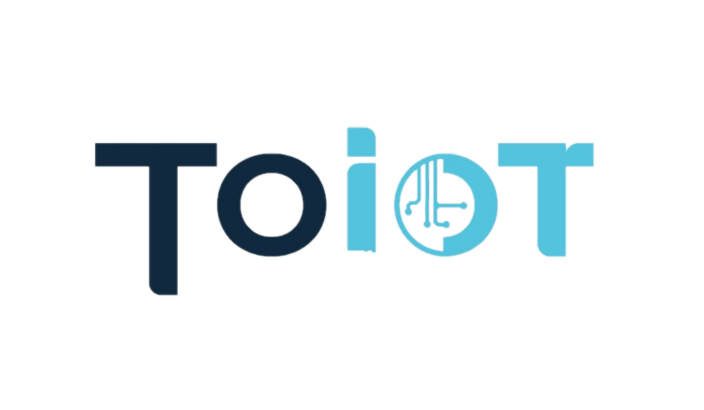

  

    
  

  

    
  

# ToDevC3 - ESP32-C3 WROOM Geliştirme Kiti

ToDevC3tf 1.0.0, ESP32-C3-WROOM-02-H4 modülü tabanlı, endüstriyel kullanıma uygun tasarlanmış kullanıma hazır bir geliştirme kitidir.

## Temel Özellikler

- ESP32-C3-WROOM-02-H4 WiFi/Bluetooth modülü (-40°C ~ 105°C çalışma sıcaklığı)
- Geniş çalışma voltajı aralığı (5V ve 6V - 28V)
- USB Type-A erkek konnektör ve izole USB bağlantı noktası
- Hazır lehimlenmiş bileşenler (buton, LED, MOSFET'ler)
- Tak-çalıştır özelliği ile hızlı kurulum
- Arduino OTA desteği ile kablosuz programlama

## Donanım Özellikleri

### LED Kontrol Özellikleri
- RGB LED'ler için 3 kanal MOSFET çıkışı
- Adreslenebilir LED şeritler için 5V sinyal çıkışı
- WLED uygulamaları için optimize edilmiş tasarım

### Güç Özellikleri
- 6V - 28V giriş voltajı desteği
- 5V regüle çıkış
- PWM kontrollü güç çıkışları

### PCB Özellikleri
- Her pin için 8 adete kadar 1206 kılıf ve DIP malzeme desteği
- Altınkaya kutu modellerine uyumlu PCB boyutları
- Endüstriyel standartlarda PCB tasarımı

## Yazılım Özellikleri

- Arduino OTA özelliği ile kablosuz yazılım güncelleme
- Temel işlevler içeren hazır yazılım paketi
- WLED uyumlu
- Örnek uygulamalar ve kütüphaneler

## Dokümanlar

- [Başlangıç Rehberi](docs/getting-started.md)
- [Pin Diyagramı](docs/pinout.md)
- [Örnek Kodlar](examples/)
- [Devre Şeması](docs/schematic.pdf)
- [3D Baskı Dosyaları](models/stl/)

## Mekanik Tasarım

### Uyumlu Kutu Modelleri
- **Duvar Tipi Kutular:**
  - [DM-013](https://www.altinkaya.com/tr/shop/dm-013-duvar-tipi-kutu-1122#attr=14957) (87.5 x 45 x 23.3 mm)
  - [DM-014](https://www.altinkaya.com/tr/shop/dm-014-duvar-tipi-kutu-1123#attr=14959,14966) (87.5 x 45 x 23.3 mm)
- **El Tipi Kutular:**
  - [HH-013](https://www.altinkaya.com/tr/shop/hh-013-el-tipi-kutu-1285#attr=15749) (87.5 x 45 x 23.3 mm)
  - [HH-014](https://www.altinkaya.com/tr/shop/hh-014-el-tipi-kutu-3434#attr=22156,22157,26870,22161) (87.5 x 45 x 23.3 mm)

> **Not:** PCB tasarımı, [Altınkaya Elektronik](https://www.altinkaya.com.tr)'in standart kutu modellerine tam uyumludur. Tüm modeller için montaj noktaları ve boyutlar optimize edilmiştir.

### Kutu Montaj Örneği

  
  
<em>DM/HH serisi kutulara tam uyumlu PCB yerleşimi</em>

### Montaj Seçenekleri
- Duvar montajı (DM serisi)
- Taşınabilir kullanım (HH serisi)
- 3D baskı özel kutu tasarımları

## Destek

Sorularınız için [Issues](https://github.com/kullaniciadi/ToDevC3t/issues) sayfasını kullanabilir veya [Discussions](https://github.com/kullaniciadi/ToDevC3t/discussions) bölümünde toplulukla etkileşime geçebilirsiniz.

## Lisans

Bu proje [MIT Lisansı](LICENSE) altında lisanslanmıştır.

## Teknik Detaylar

### Güç Yönetimi
- TPS54302 regülatör ile endüstriyel güç beslemesi
  - Giriş voltajı: 6V - 28V
  - Çıkış: 5V
- AMS1117-3.3 ikincil regülatör
  - 3.3V ve 5V çıkışlarda 800mA güç kapasitesi
  - 5V PWM çıkış desteği
- IR sensörler için özel 3.3V RC filtre devresi (100R & 10uF)

### USB Bağlantı Özellikleri
- Çift yönlü USB Type-A erkek port tasarımı
  - 1.6mm PCB kalınlığında optimize edilmiş tasarım
  - Bir yönde bilgisayar bağlantısı ve 5V besleme
  - Diğer yönde izole haberleşme (+uç olmadan)
- Özel tasarım plastik kalınlaştırıcı aparatı ile tam uyum

### GPIO ve Bileşen Özellikleri
- Hazır Lehimli Bileşenler:
  - IO6: Buton
  - IO5: Bildirim LED'i (1K direnç ile)
  - IO2, IO8, IO9: 4K7 pullup dirençler
  - IO8 ve IO9: I2C haberleşme için optimize

### Genişletme ve Özelleştirme
- Analog Pinler:
  - Üst bölgede 2x 1206 SMD bileşen yuvası
  - Orta bölgede 4x 1206 SMD + 2x DIP bileşen yuvası
  - Voltaj bölücü, kapasitör, zener diyot uyumlu tasarım

- Dijital Pinler:
  - Orta bölgede 4x 1206 SMD + 2x DIP bileşen yuvası
  - IO6'da gürültü önleyici 100nF kapasitör

### Programlama ve Boot
- ToioT başlangıç yazılımı yüklü
- Boot tuşlarına gerek olmadan:
  - USB üzerinden direkt programlama
  - Arduino OTA ile kablosuz programlama
- Hazır boot yapılandırması

### Montaj Özellikleri
- Çift taraflı bileşen montaj imkanı
  - LED ve buton için alternatif montaj noktaları
  - Delikli PCB bağlantı noktaları
- Mantar LED desteği
  - SMD LED'e paralel montaj imkanı
  - 603 kılıf SMD LED alternatifi

## Ürün Görselleri

  
  

### Kutu Tasarımı

## Pin Diyagramı

  

### Pin Açıklamaları

#### Pcb Üzerindeki Kıslatmalar
- A Analog
- D Dijital
- B BTN Buton
- L LED
- F FET Mosfet
- S Strapping pin (çevreleme pinleri boot yapılandırması için, yazılımdan kontrol edilebilir)
- G GND
- VCC + voltaj girişi
- EN Enable
- RC Direnç Kapasitör filtresi
- LC Indüktör Kapasitör filtresi
- R_VBx Voltaj bölücü veya pin öncesi direnç
- R_VBx- Voltaj bölücü direnç
- Rx- Pulldown direnç
- Rx+ Pullup direnç
- Rakamlar pin numaralarıdır.

#### Analog Girişler
- A0-A4: Analog giriş pinleri (R_VB0 - R_VB4)
- ADCvb bölümündeki padler direnç lehimlenmediği durumlarda açık devredir, voltaj bölücü olarak kullanılabilir.
- GPIO padleri direk işlemciye bağlıdır.

#### UART ve USB
- TX/RX: UART haberleşme pinleri
- D+/D-: USB data pinleri
- +5V: USB güç girişi

#### GPIO Pinleri
- IO0-IO10: Genel amaçlı giriş/çıkış pinleri

#### Güç ve Kontrol
- VCC: 6-24V güç girişi
- GND: Toprak bağlantıları
- 3v3: 3.3V güç çıkışı
- 5vPWM: 5V PWM çıkışı

#### LED ve Buton
- LED IO5: Durum LED'i
- BTN IO6: Kontrol butonu

#### MOSFET Çıkışları
- FET 7-8-9: RGB ve güç anahtarlaması için MOSFET çıkışları
- FET 10: Adreslenebilir LED şeritler veya 5v pwm için MOSFET çıkışı

### USB Bağlantı Detayları

  

    

      
      
<em>Normal USB bağlantısı (Güç ve Veri)</em>

    

    

      
      
<em>İzole edilmiş USB bağlantı (+uç izolasyonu)</em>

    

    

      
      
<em>Özel tasarım USB kalınlaştırıcı adaptör</em>

    

  

#### USB Bağlantı Özellikleri
- PCB üzerinde 1.6mm kalınlığında USB Type-A erkek konnektör
- Çift yönlü kullanım imkanı:
  1. **PC Bağlantısı:** Bir yönde tam USB bağlantısı (güç ve veri)
  2. **İzole Mod:** Diğer yönde sadece veri bağlantısı (+uç olmadan)
- Özel tasarım plastik kalınlaştırıcı adaptör:
  - Standart USB portlarına tam uyum sağlar
  - PCB'yi korur ve sağlam bağlantı sağlar
  - Kolay takıp çıkarma imkanı

> **Not:** İzole mod sayesinde harici güç kaynağı kullanırken bile güvenli PC bağlantısı sağlanır. PCB üzerindeki +uç izolasyonu sayesinde çift taraflı kullanım güvenlidir.

## Pin Yapılandırması ve Örnek Devreler

  

### Çevre Birim Bağlantıları

#### I2C Pinleri (IO8 ve IO9)
- 4.7K Pull-up dirençleri hazır

#### Analog Giriş Yapılandırması (IO0-IO4)
- Voltaj bölücü dirençler için hazır ayak izleri
- Analog pinlerin yanında 1206 kılıf bileşen yuvaları
- Örnek voltaj ölçüm devreleri:
  - 24V VCC ölçümü için voltaj bölücü
  - 12V sensör girişi için koruma devresi

#### PWM Çıkış Özellikleri (IO10)
- 5V PWM çıkışı (Adreslenebilir LED'ler için uygun)
- RGB LED kontrolü veya güç anahtarlaması için 3 kanal 5A 30V MOSFET
- Her kanal için ayrı kontrol

### Koruma ve Filtreleme
- 3V3 RC filtre (100R & 10uF)
- Vcc giriş LC filtresi (2.2uH & 100nF)

#### Sinyal Filtreleme
- IR ve benzerisensörler için 3V3 RC filtre (100R & 10uF)
- Buton parazit önleme (100nF kapasitör)
- Sinyal gürültü önleme için her pinde hazır 1206 smd ve dip kapasitör yuvaları

#### Pinlerde Aşırı Gerilim Koruması
- Zener diyot lehimleyerek pinleri koruyabilirsiniz.
- Her pin için ayrı koruma devresi imkanı
- 1206 SMD ve DIP bileşen uyumlu tasarım

### Örnek Uygulamalar

1. **Voltaj Ölçümü**
   - 24V giriş için voltaj bölücü
   - Filtreleme kapasitörü
   - Zener koruma

2. **Sensör Bağlantısı**
   - 12V sensör girişi
   - Akım sınırlayıcı direnç
   - Sinyal filtreleme

3. **LED Kontrolü**
   - RGB LED sürücü devresi (IO7-IO8-IO9)
   - 5V PWM çıkışı (IO10)
   - Adreslenebilir LED kontrolü (IO10)

### Önemli Pin Kullanım Notları

> **Pin Çakışmaları ve Alternatifler:**
> 
> 1. **RGB LED ve I2C Kullanımı:**
>    - IO8 ve IO9 pinleri hem I2C hem de RGB LED kontrolü için önerilmiştir, RGB LED kullanılacaksa, I2C için alternatif pinler seçilmeli.
> 
> 2. **Analog ve I2C Pin Paylaşımı:**
>    - Analog pinler (IO0-IO4) I2C için kullanılabilir
>    - Bu durumda ilgili pin analog giriş olarak kullanılamaz
>    - Her pin için sadece bir fonksiyon seçilmelidir
>    - IO2 çevreleme pini olduğundan 4k7 pullup halihazırda mevcuttur.
>
> 3. **PWM ve LED Kontrol Öncelikleri:**
>    - IO10: Adreslenebilir LED kontrolü ve pwm sinyal çıkışı için optimize edilmiş.
>    - IO7-IO8-IO9: RGB LED kontrolü ve benzeri yük anahtarlama MOSFET çıkışlarıdır. 
>    - Bahsigeçen pinler Mosfetler gözardı edilip başka amaçlar için kullanılabilir.

### Önerilen Pin Kombinasyonları

1. **RGB LED Odaklı Kullanım:**
   - RGB LED: IO7, IO8, IO9
   - I2C: IO1(4K7 pullup lehimleyin), IO2(4K7 pullup mevcut)
   - Analog Girişler: IO0, IO3, IO4
   - WS2812: IO10

2. **I2C Sensör Odaklı Kullanım:**
   - I2C: IO8, IO9
   - Analog Girişler: IO0-IO4
   - PWM/LED: IO7, IO10

3. **Analog Sensör Odaklı Kullanım:**
   - Analog Girişler: IO0-IO4
   - RGB LED: IO7-IO9
   - WS2812: IO10
